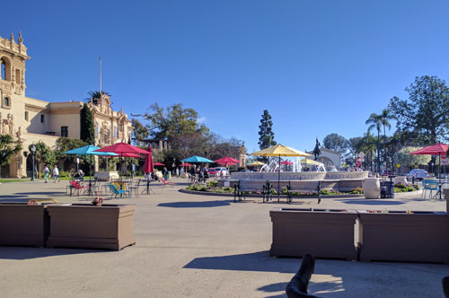
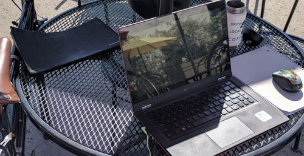

In the middle of the Plaza de Panama  is a collection of wrought-iron tables shaded by colorful umbrellas. The City of San Diego voted to preserve the Plaza in 2016, concocting a $45 million renovation plan, which got knocked down to $300k, hence the paved-over parking lot smattered with aforementioned wrought-iron/umbrellas we have today. The space seems geared toward weary tourists, but Perhaps Parks &amp; Rec considered San Diego's writers and telecommuters, given the fast, reliable public wifi. Slapdash renovation aside, I've added the Plaza to my regular rotation of fair weather workspaces. 

The popularity of Balboa among tourists and residents is in my book selling point. Working around people on vacation reminds me I live somewhere people pay to visit. And the openness of the Plaza, as well as the buffer it provides from traffic, makes this more tranquil than most caf&#233;s. 

You can see I rode my bike, which I recommend as parking around Balboa can be tough, especially on weekends, and because you can't park near the Plaza&mdash;again, on account of the renovation. And you'll want to bring a mousepad of some sort, and probably a cooling pad for your laptop, as the iron tables can get hot. On the bright side, tables are spacious, so you can throw your crap wherever. Not to mention a thermos with your favorite caffeinated beverage (or adult beverage, cause hey, who's checking?). 

Alternately, I recommend Panama 66 to extend your writing excursion into the evening or to escape the blistering sun. Despite it's prime location, the bar doesn't price gouge and actually has a decent drink and food selection. Plus the abstract sculpture in the garden weirds up my writing when I'm starting to make too much sense. 

Pros
---

<ul class>
<li>Free (BYOB/C)</li>
<li>You're in the classiest park in the city</li>
<li>Seating always available</li>
<li>Myriad sources of inspiration (museums, fish, ducks, buskers, lost grandmas)</li>
<li>Fast internet (seriously, better than most caf&#233;s)</li>
<li>You can prop your bike against table for added convenience &amp; security</li>
</ul>

Cons
---

<ul>
<li>Minimal defense vs. sun &amp; rain (but you can sneak into the shaded sculpture garden restaurant)</li>
<li>Grated tables make a poor writing and mouse surface</li>
<li>Tricky parking</li>
</ul>

Informative Haiku
---
in the public pond   
the koi paint their scales gold  
silent, a donation 

<a href="https://www.yelp.com/biz/plaza-de-panama-san-diego" target="_blank">Yelp it</a>

